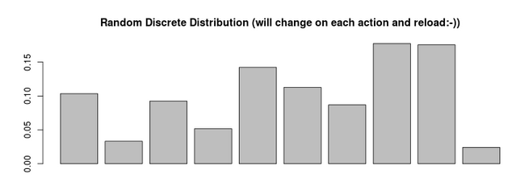
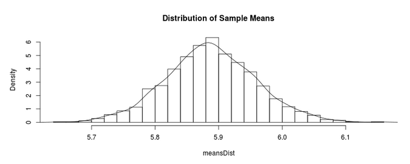
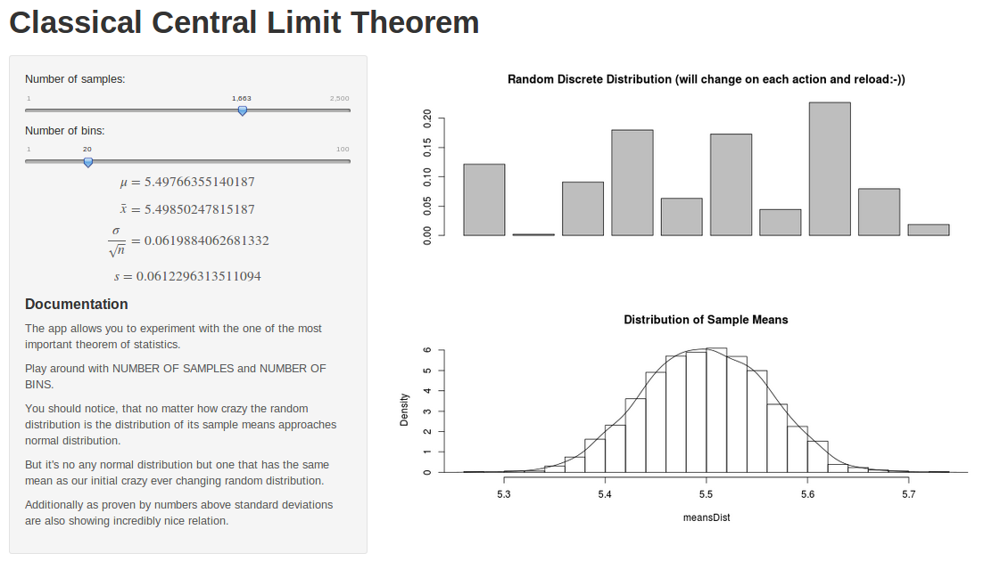

## Central Limit Theorem

* Start from any no matter how crazy distribution
* Sample it many time and at each step calculate mean of your sample
* If you plot the distribution  of those means you should see nice well known shape resembling normal distribution bell's curve
* The parameters of this curve are govern by paramters of the original crazy distribution and number of samples

--- 

## So what should you see?

* Random Distribution:  

* Distribution of sample means drawn from the Random Distribution:  

* Means will be almost identical $\bar{x} = \mu$
* And the following relationship will connect standard deviations: $\frac{\sigma}{\sqrt{n}} \rightarrow s $

--- 

## Experiment and feel the theorem 

* Experience CLT by playing with my app:  
</img>

* Play around with the number of samples that will be produced out of our ever changing random distribution
* Feel! how means are following each other 
* Observe! how nicely relationship between standard deviations emerges

--- 

## What's next

* Central Limit Theorem and Normal Distributions are strong foundation of not only statistics but our modern world!
* The "averaging" behaviour of random distributions shows how incredibly well structured our world is.
* Explore more to discover even more amazing examples of such an "averaging"

